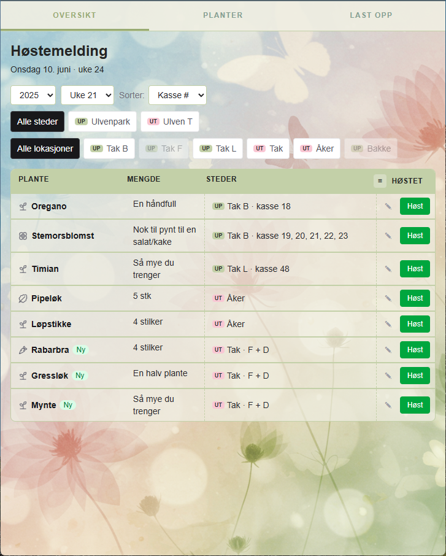
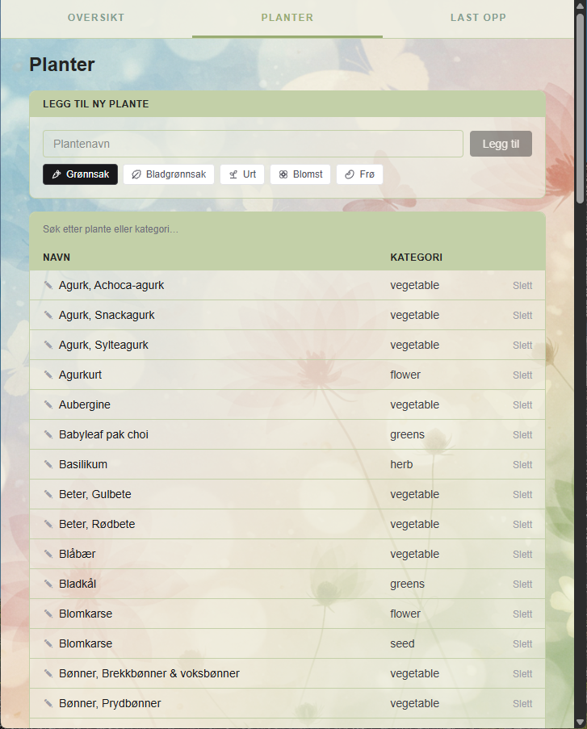
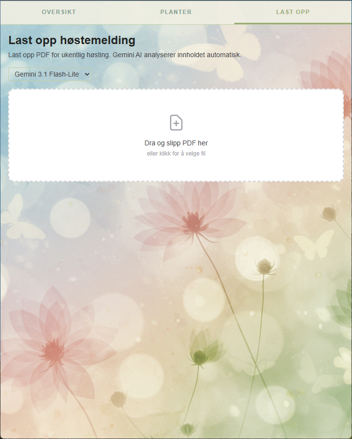
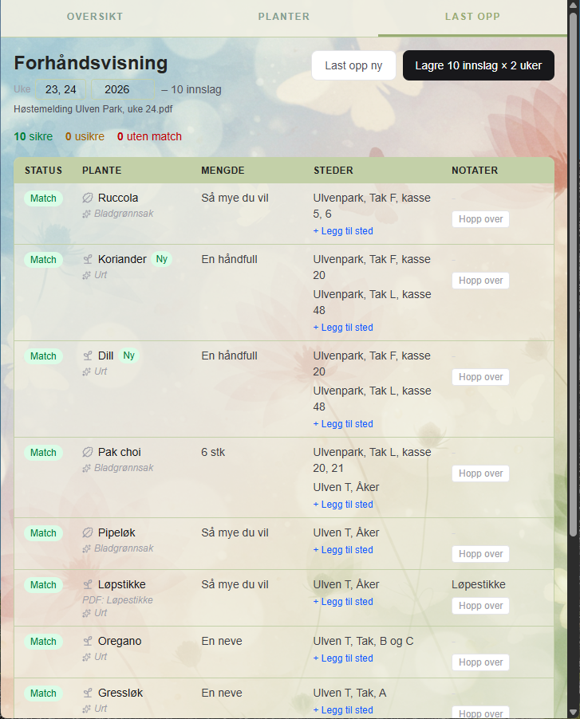

# Harvest

A web app for tracking weekly harvest reports from a community garden.

### Screenshots






## Tech Stack

-   Next.js 16 (App Router)
-   TypeScript
-   Tailwind CSS
-   PostgreSQL
-   Google Gemini API

## Development

```bash
# Install dependencies
npm install

# Start PostgreSQL (requires Docker)
docker-compose up -d

# Run development server
npm run dev
```

Open [http://localhost:3000](http://localhost:3000).

## Project Background

See [PROJECT_PLAN.md](./PROJECT_PLAN.md) for full project documentation including database schema, API design, and implementation phases.
